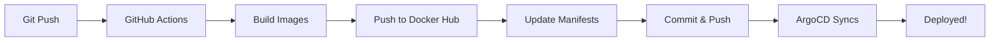

# DevOps System Configuration Guide

> **IMPORTANT**: This guide explains what you need to configure before using this DevOps Kit. All configurations are in **ONE place** for easy setup.

## 📌 Quick Setup Checklist

- [ ] Setup GitHub repository secrets
- [ ] Configure Helm values (if using Helm)
- [ ] Update kustomization.yaml (if using Kustomize)
- [ ] Review and set environment variables

---

## 1. GitHub Repository Secrets

**Location**: GitHub Repository → Settings → Secrets → Actions

Add these **3 required secrets**:

| Secret Name | Description | Example Value |
|------------|-------------|---------------|
| `DOCKER_NAME` | Your Docker Hub username | `yourname` |
| `DOCKER_TOKEN` | Docker Hub access token | `dckr_pat_xxx...` |
| `PAT_TOKEN` | GitHub Personal Access Token | `ghp_xxx...` |

### How to Get These Values:

**DOCKER_NAME & DOCKER_TOKEN:**
1. Go to [hub.docker.com](https://hub.docker.com)
2. Account Settings → Security → New Access Token
3. Copy the token (this is `DOCKER_TOKEN`)
4. Your username is `DOCKER_NAME`

**PAT_TOKEN:**
1. GitHub → Settings → Developer Settings → Personal Access Tokens → Tokens (classic)
2. Generate new token with `repo` scope
3. Copy the token

---

## 2. Image Configuration

### For Level 2 (Kustomize)

**File**: `devops/k8s/kustomization.yaml`

```yaml
images:
- name: devops-client-image
  newName: ${DOCKER_USERNAME}/devops-client  # ← Auto-updated by GitHub Actions
  newTag: latest                              # ← Auto-updated by GitHub Actions

- name: devops-server-image
  newName: ${DOCKER_USERNAME}/devops-server  # ← Auto-updated by GitHub Actions
  newTag: latest                              # ← Auto-updated by GitHub Actions
```

**✅ No manual changes needed!** GitHub Actions automatically replaces `${DOCKER_USERNAME}` with your actual Docker Hub username.

### For Levels 3-5 (Helm)

**Files**:
- `devops/helm/client/values.yaml`
- `devops/helm/server/values.yaml`

```yaml
image:
  repository: DOCKER_USERNAME/devops-client # DOCKER_USERNAME/devops-client
  tag: "latest" # IMAGE_TAG
```

**✅ No manual changes needed!** GitHub Actions automatically:
1. Replaces `DOCKER_USERNAME` with your Docker Hub username
2. Updates `tag` with the commit SHA

---

### 3. API URL Configuration (Runtime)
The client application needs to know where the backend API is running. This is configured via a `config.js` file injected at runtime.

**For Level 2 (Kustomize):**
- File: `devops/k8s/client-configmap.yaml`
- Update: `API_URL: "http://MINIKUBE_IP:30002"` (Replace `MINIKUBE_IP` with your actual Minikube IP)

**For Levels 3-5 (Helm):**
- File: `devops/helm/client/values.yaml`
- Update: `config.apiUrl: "http://MINIKUBE_IP:30002"`

> **Note:** The setup scripts will prompt you to update this value and show you your Minikube IP.

### 4. Environment Variables
The application uses the following environment variables. Most are handled automatically by the Helm charts/Kustomize.

### Server Configuration

**File**: `devops/k8s/server.yaml` OR `devops/helm/server/values.yaml`

These are **already configured** with development defaults:

```yaml
env:
  - name: NODE_ENV
    value: development
  - name: DATABASE_CLIENT
    value: postgres
  - name: DATABASE_HOST
    value: postgres
  - name: APP_KEYS
    value: "..." # Pre-configured
  - name: JWT_SECRET
    value: "..." # Pre-configured
```

**⚠️ For Production**: Change `NODE_ENV` to `production` and generate new secrets:
```bash
node -e "console.log(require('crypto').randomBytes(64).toString('base64'))"
```

---

## 4. ArgoCD Configuration

### Repository URL

**File**: `level-X/scripts/mac-linux/setup-infrastructure.sh`

The setup script **automatically detects** your Git repository URL:

```bash
REPO_URL=$(git remote get-url origin)
```

**Only change if**: You want to point to a different repository.

---

## 5. What Happens Automatically?

When you push code to GitHub:



**GitHub Actions will**:
1. Build Docker images
2. Tag with commit SHA
3. Push to your Docker Hub (using `DOCKER_NAME`)
4. Update manifests with new image tags
5. Commit and push back (using `PAT_TOKEN`)

**ArgoCD will**:
1. Detect manifest changes
2. Pull new manifests
3. Deploy to Kubernetes automatically

---

## 6. Configuration Summary by Level

| Level | What to Configure | Where |
|-------|------------------|-------|
| Level 1 | GitHub Secrets only | Repository Settings |
| Level 2 | GitHub Secrets only | Repository Settings |
| Level 3 | GitHub Secrets only | Repository Settings |
| Level 4 | GitHub Secrets only | Repository Settings |
| Level 5 | GitHub Secrets only | Repository Settings |

**✅ Bottom Line**: Just set up GitHub secrets once, and everything else is automatic!

---

## 🚫 What NOT to Change

Do not manually edit these in your files:
- ❌ `${DOCKER_USERNAME}` in kustomization.yaml
- ❌ `DOCKER_USERNAME` in Helm values
- ❌ Image tags (these are auto-updated)
- ❌ Repository URLs in ArgoCD manifests (auto-detected)

These are **placeholders** that get replaced automatically by GitHub Actions!

---

## ❓ Troubleshooting

**Q: GitHub Actions failing with "permission denied"?**  
A: Check that your `PAT_TOKEN` has `repo` scope.

**Q: Images not found in Docker Hub?**  
A: Verify `DOCKER_NAME` and `DOCKER_TOKEN` are correct.

**Q: ArgoCD not syncing?**  
A: Check that the repository URL in ArgoCD Application matches your repo.

---

## 📚 Next Steps

1. **Setup Secrets**: Add the 3 GitHub secrets
2. **Run Setup Script**: `./level-X/scripts/mac-linux/setup-infrastructure.sh`
3. **Push Code**: `git push`
4. **Watch It Deploy**: Check ArgoCD dashboard!
